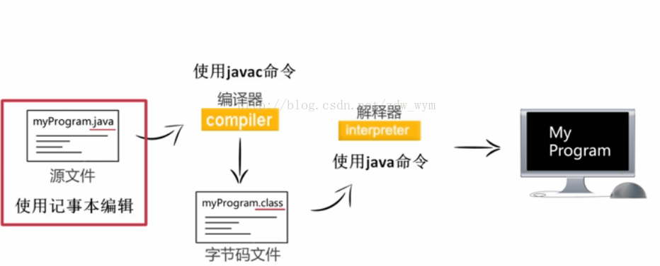
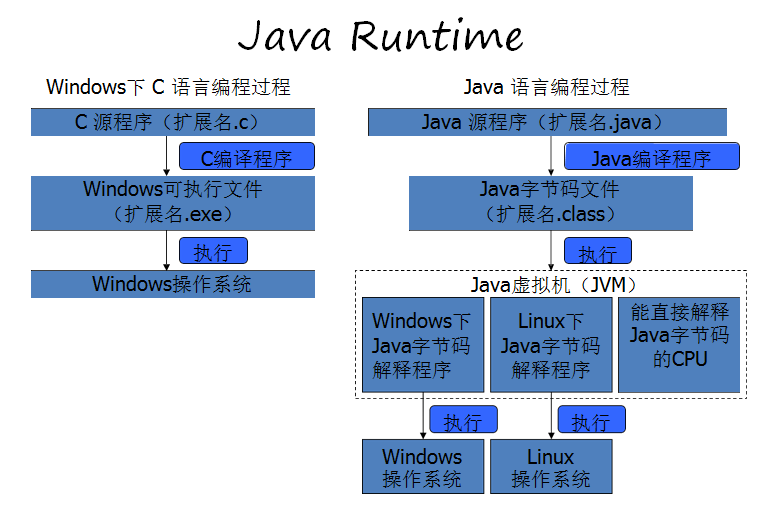
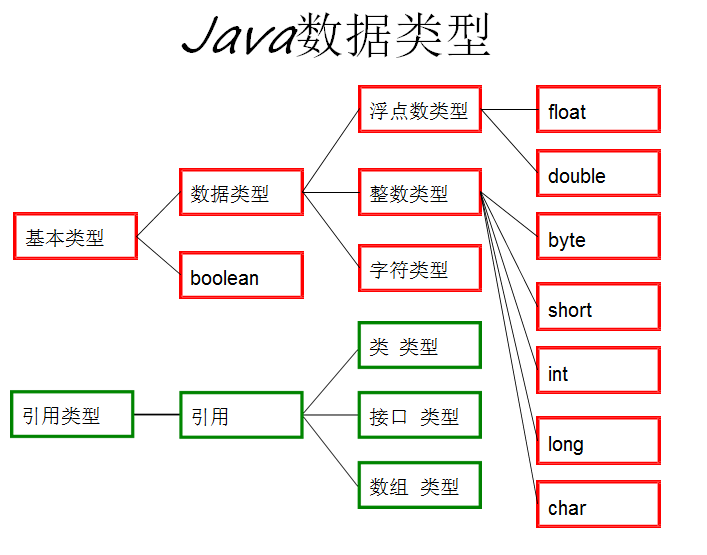
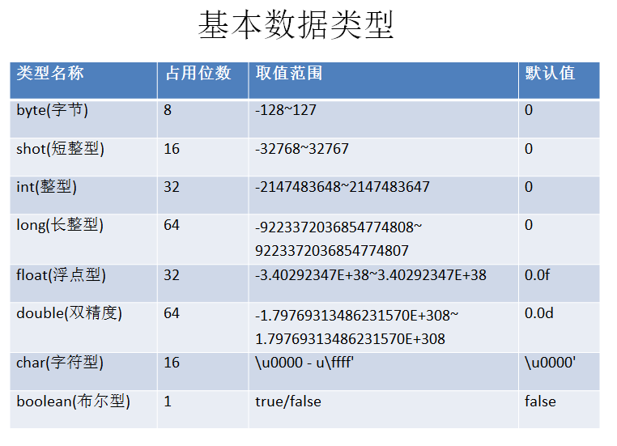
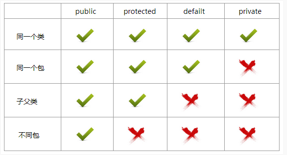

# Java 语言 快速入门  

## 简介

- **运行原理**
  1. Java 的源程序首先由编译器（javac.exe）编译成字节码。
  2. 再由解释器（java.exe）解释执行。
  3. Java 解释器能直接在任何机器上执行 Java 字节码。
	
  4. 示例代码：  
  ```Java
	public class Demo{
	public static void main (String[] args){
		System.out.println("Hello , Oray!");
		} 
	}
  ```
  5. 命令行执行
  ```CMD
	javac Demo.java //编译Demo.java为字节码文件Demo.class
	java Demo //解释运行Demo.class文件
  ```

- **JVM 虚拟机**
  1. Java 虚拟机简称为 JVM ,也叫 Java 运行环境(Java Runtime Environment),其本质是使用软件模拟计算机运行环境,为 Java 程序运行提供环境,以解决程序本身的平台依赖性质。  
  2. C 语言和 Java 语言编译运行过程对比：
	

- **JDK \ JRE**
  - JDK: Java Development Kit , 包含了 java 虚拟机，java 基础类库。是使用 java 语言编写的程序运行所需要的软件环境，是提供给想运行 java 程序的用户使用的。  
  - JRE: Java Runtime Environment ,JDK 包含了 JRE，同时还包含了编译 java 源码的编译器 javac 。

- **IDE工具**
  - IDE: Integrated Development Environment 集成开发环境，集编辑、编译、调试运行于一身的开发工具。
  - 常用如：Eclipse 、MyEclipse 、NetBeans、 IntelliJ idea 等。


## 基础

- **数据类型**  
  Java 语言中共有八大基本数据类型和三种引用数据类型。  

  
  

- **符号与逻辑控制语句**  
  1. 连接符 +
	``` Java
    当 + 号两边的操作数皆为数值类型的时候执行加法运算,结果为数值类型。
    当 + 号两边任意一边的操作数为字符串的时候执行连接操作,结果为字符串类型。  
	```
  2. 算术运算符  
	``` Java
	++ : 递增 a++ 或 ++a
	-- : 递减 a-- 或 --a
	-  : 取负 -a
	+  : 加法 a+b
	-  : 减法 a-b
	*  : 乘法 a*b
	/  : 除法 a/b
	```

  3. 赋值运算符
	``` Java
	+= : a=a+b 可以写成 a+=b
	-= : a=a-b 可以写成 a-=b
	*= : a=a*b 可以写成 a*=b
	/= : a=a/b 可以写成 a/=b
	%= : a=a%b 可以写成 a%=b
	```
  4. 关系运算符
    ``` Java
	== : 检查两个数的相等性
	!= : 检查两个数的不等性
	>  : 检查左边的值是否大于右边的值
	<  : 检查左边的值是否小于右边的值
	>= : 检查左边的值是否大于或等于右边的值
	<= : 检查左边的值是否小于或等于右边的值
	```
  5. 逻辑运算符
	``` Java
	!  : 逻辑非,一元运算符,将某 boolean 结果取反。
	&& : 逻辑与,两边的 boolean 结果为 true 则表达式结果为 true 按照短路方式求值,当 && 左边的结果为 false 时, 整个表达式的结果必定为 false,所以不再执行右边的运算。
	|| : 逻辑或,两边的 boolean 结果任意一边为 true 则为表 达式结果 true 按照短路方式求值,当 || 左边的结果为 true 时,整个表达式的结果必定为 true,所以不再执行右边的运算。
	```
  6. 逻辑控制语句
    - 条件语句
	  - if ... else
      - switch ... case
    - 循环语句
	  - while
	  - do ... while  
	  - for
	- 跳转语句
	  - break;
	  - continue;    
	  - return;   
</br> 
 
- **Java 代码的基本结构**
  项目(project) --> 包(pakage) --> 类(class) --> 属性(attribute)、方法(method)
	
  - 类
	```
	  - 类的成员
		- 属性（变量）
		- 方法（函数）
	  - 类的使用
		- 定义类：实例化类的对象（如使用 new 创建类的一个对象）。
		- 使用对象：给类的属性赋值、调用类的方法。
	```
	这样的一个 Animal.java 文件就是一个类文件。
	``` Java
	package teach;  //声明 teach 是包的名字，代码坐在的这个.java文件在teach这个包里面的。

	public class Animal {  //Animal 是类名。

	  int weight = 100;    //变量 weight 是 Animal 类的属性。

	  public void eat() {  //eat() 是 Animal 类的方法，这个方法打印了 "I'm eating" 这句话,并增加了一点体重。
		System.out.println("I'm eating");
		weight += 1;
	  }
	}
	```

  - 方法
	Java方法是语句的集合，它们在一起执行一个功能,一般情况下，定义一个方法包含以下语法	：
	``` Java
	修饰符 返回值类型 方法名(参数类型 参数名){
	    ...
	    方法体
	    ...
	    return 返回值;
	}
	```
	>**修饰符**：修饰符，这是可选的，告诉编译器如何调用该方法。定义了该方法的访问类型。
	**返回值类型** ：方法可能会返回值。returnValueType 是方法返回值的数据类型。有些方法执行所需的操作，但没有返回值。在这种情况下，returnValueType 是关键字 void。
	**方法名**：是方法的实际名称。方法名和参数表共同构成方法签名。
	**参数类型**：参数像是一个占位符。当方法被调用时，传递值给参数。这个值被称为实参或变量。参数列表是指方法的参数类型、顺序和参数的个数。参数是可选的，方法可以不包含任何参数。
	**方法体**：方法体包含具体的语句，定义该方法的功能。


- **面向对象**

  - OOP(Object Oriented Programming) 面向对象编程就是使用对象进行程序设计，包含封装、继承、多态三大特性。
  - 封装：隐藏实现细节，使得代码模块化。
	``` Java
	package teach;

	public class Test {
	
		public static void main(String[] args) {
			Animal animal = new Animal(); //实例化Animal类的对象。
			animal.eat();  //这里的这一行代码就将上文 Animal 类中的 eat() 方法实现了一次，而不需要在重写打印语句。
		}
	}
	```
  - 继承：使用现有类的所有功能，并在无需重新编写原来的类的情况下对这些功能进行扩展。
	``` Java
	package teach;
	
	public class Fish extends Animal{ //继承关键词 extends,Animal 成了 Fish 的父类。
	
		String type = "鲫鱼";
		int weight = 2;
		
		public void swim() {
			weight -= 1;
			System.out.println("游泳体重-1，当前体重为 " + weight);
			
		}
	}
	```
	``` Java
	package teach;
	
	public class Test {
	
		public static void main(String[] args) {
			Fish littleFish = new Fish();
			//Fish 类里面没有写 eat() 方法，但是由于 Fish 类继承了 Animal类
			//所以Fish类的 littleFish 对象能够使用甚至改造父类 Animal 中的属性和方法。
			littleFish.eat();  
		}
	}
	```
  - 多态：方法的多种形式，使用不同的实例而执行不同的操作。包含重写、和重载。
    - 重写 ：一个类M继承另一个类N，N中有一个方法A，这时你在M写了一个方法B，方法B的名字、返回值以及参数都和A一样，此时B重写了A。
	``` Java
	package teach;
	
	public class Fish extends Animal{
	
		String type = "鲫鱼";
		int weight = 2;
		
		public void eat() {  //重写父类方法 eat()
			super.eat();     //super关键词代表父类，这一行代码代表父类的 eat();方法
			weight += 1;
			System.out.println("小鱼吃东西体重+1，当前体重为 " + weight);
		}
		
		public void swim() {  //小鱼独有的方法 swim();
			weight -= 1;
			System.out.println("游泳体重-1，当前体重为 " + weight);
			
		}
	}
	```
	- 重载 ：一个类中有一个方法A，你又在这个类中创建了一个方法B，方法B的名字和A一样，返回值类型也一样，但是参数的类型或个数不同，此时B重载了A。
	``` Java
	package teach;
	
	public class Fish {
	
		String type = "鲫鱼";
		int weight = 2;
		
		public void swim() {
			weight -= 1;
			System.out.println(type +" 游泳体重-1，当前体重为 " + weight);
		}
		
		public void swim(String type , int weight) {  //两个 swim 方法内容相同，但是第二个方法多了传入两个参数。
			weight -= 1;
			System.out.println(type+" 游泳体重-1，当前体重为 " + weight);
		}
	}
	```
	``` Java
	package teach;
	
	public class Test {
	
		public static void main(String[] args) {
			Fish littleFish = new Fish();
			littleFish.swim();
			littleFish.swim("草鱼",3);
		}
	}
	```
	``` Java
	输出结果：
	鲫鱼 游泳体重-1，当前体重为 1
	草鱼 游泳体重-1，当前体重为 2

	```
- **关键词**
  - 权限修饰词： public 、 private  、 protected  、 默认的（default）
	
  - 状态修饰词 : static 、final 、abstract
    - static 
	  1. 可以调用其他静态方法、必须访问静态数据、不能使用 super 或 this 关键字。
	  2. static修饰属性：静态储存区的数据（包括方法代码），不管有多少对象引用，均只有1份。
    - final
      1. 属性和方法前加修饰词 final,则该属性不能修改，该方法都不能被重写。
	- abstract 
      1. 修饰方法为抽象方法
	  2. 由abstract修饰的类叫抽象类，抽象方法必须在抽象类，抽象方法内不能包含任何逻辑，由子类来重写实现细节。
	  3. 抽象类不能被实例化。

	
	 
  
  

