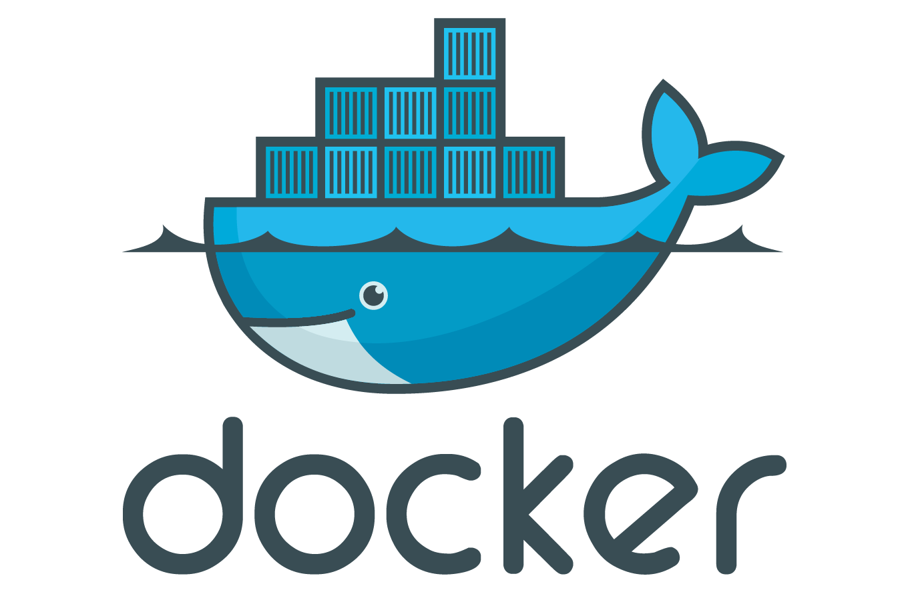
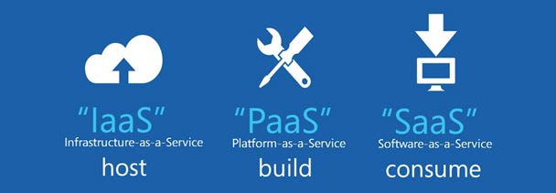
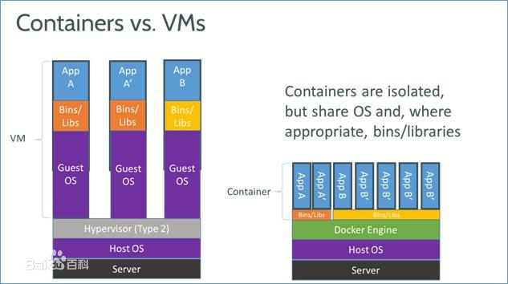
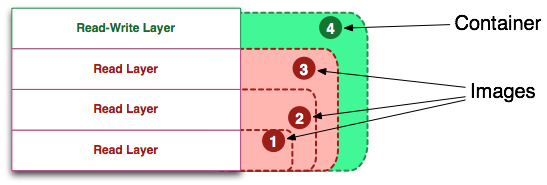
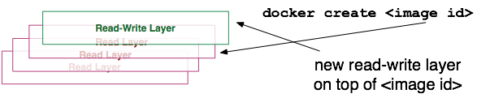

# docker 入门


## docker 起源
2010年，旧金山成立了一家做 PaaS 平台的公司，起名为 dotCloud。dotCloud 主要是基于 PaaS 平台为开发者或开发商提供技术服务。 
- 什么是Paas ?  
任何一个在互联网上提供其服务的公司都可以叫做云计算公司。其实云计算分几层的，分别是Infrastructure（基础设施）-as-a- Service，Platform（平台）-as-a-Service，Software（软件）-as-a-Service。基础设施在最下端，平台在中间，软件在顶端。  

> dotCloud 把需要花费大量时间的手工工作和重复劳动抽象成组件和服务，并放到了云端，另外，它还提供了各种监控、告警和控制功能，方便开发者管理和监控自己的产品。dotCloud 最初运行在 Amazon 的 EC2 上，不过由于 dotClout 高度的抽象层次，理论上 dotCloud 可以运行在各种各样的云服务上面。  
一切看起来都是那么的美好，如果后来的事情按照这个设想进行下去的话，软件厂商和程序员都会松好几口气。
虽然，PaaS 的概念虽好，但是由于使用者认知、理念和技术的局限性，市场的接受度并不高，市场的规模也不够大。除此之外，还有巨头不断进场搅局，IBM 的蓝云，微软的 Azure，Amazon 的 EC2，Google 的 GAE，VMware 的 Cloud Foundry 等等，在这种情况下，虽然 dotCloud 在2011年初拿到了1000万美元的融资，但依然举步维艰。  
于是，dotCloud 的创始人 Solomon Hykes 把大伙召集到一起，说，咱们过的不舒服，也不能让别人痛快了，干脆把我们的核心引擎开源扔到市面上看看，如何？大家面面相觑，最后把拳头砸到桌面上，就这么办。  
这个基于 Linux Container 技术的核心管理引擎一经开源立刻得到了「业界」的热烈吹捧，这个容器管理引擎大大降低了容器技术的使用门槛，轻量级，可移植，虚拟化，语言无关，写了程序扔上去做成镜像可以随处部署和运行，开发、测试和生产环境彻底统一了，还能进行资源管控和虚拟化。业界几个大佬也没闲着，看看自己平台上笨重的 PaaS，纷纷表示要接入或支持这个引擎。  
这个引擎的名字叫做 Docker，以 Go 语言写成。  
从此以后，他们开始专心研发 Docker 产品和维护相关社区。  
2013年10月 dotCloud 公司更名为 Docker 股份有限公司。  
2014年8月 Docker 宣布把平台即服务的业务「dotCloud」出售给位于德国柏林的平台即服务提供商「cloudControl」。  
同年8月，Docker 内部员工 James Turnbull 发布了面向开发者、运维和系统管理员的 Docker 电子书《The Docker Book》。  
12个月过后，Docker 迅速成长为云计算相关领域最受欢迎的开源项目，Amazon、Google、IBM、Microsoft、Red Hat 和 VMware 分别表示已经支持 Docker 技术或准备支持。  
> -  [引用部分节选自《Docker 传奇之 dotCloud》—— 池建强-百家号](https://baijia.baidu.com/s?old_id=39451&wfr=pc&fr=app_list)

## docker 简介、安装、优势、劣势、与VM的区别

### 简介
Docker 是一个开源的应用容器引擎，让开发者可以打包他们的应用以及依赖包到一个可移植的容器中，然后发布到任何流行的 Linux 机器上，也可以实现虚拟化。  

### 安装
```Bash
Centos：
yum install -y epel-release
yum install docker-io # 安装docker  
 
Ubuntu:
apt-get update  
apt-get install docker # 安装docker
```
[参考 docker 安装手册](http://www.docker.org.cn/book/install/supported-platform-17.html)  
```Bash
# 基本信息查看
docker version # 查看docker的版本号，包括客户端、服务端、依赖的Go等
docker info # 查看系统(docker)层面信息，包括管理的images, containers数等
```

### docker 优势
- 通过容器打包应用。迁移的话节约时间，降低部署过程中出现风险。    
- docker 在运维中的优势：一次创建或配置，终身可以使用。  
- 在 docker 的网站上提到的docker的典型场景：  
	> Automating the packaging and deployment of applications（使应用的打包与部署自动化）  
	Creation of lightweight, private PAAS environments（创建轻量、私密的PAAS环境）  
	Automated testing and continuous integration/deployment（实现自动化测试和持续的集成/部署）  
	Deploying and scaling web apps, databases and backend services（部署与扩展webapp、数据库和后台服务）  

### docker 局限性
> Docker是基于Linux 64bit的，无法在32bit的linux/Windows/unix环境下使用  
LXC是基于cgroup等linux kernel功能的，因此container的guest系统只能是linux base的  
隔离性相比KVM之类的虚拟化方案还是有些欠缺，所有container公用一部分的运行库  
网络管理相对简单，主要是基于namespace隔离  
Docker对disk的管理比较有限  
container随着用户进程的停止而销毁，container中的log等用户数据不便收集  

### docker 与 VM 的区别
- docker与虚拟机的比较：更快、对资源需求更少、指令简单，学习成本低。


## docker 原理  

### 组成
1. dockerClient 客户端
1. Docker Daemon 守护进程
1. Docker Image 镜像
1. DockerContainer 容器  

 

### 架构
Docker 使用客户端-服务器 (C/S) 架构模式，使用远程API来管理和创建Docker容器。  
Docker采用 C/S架构 Docker daemon 作为服务端接受来自客户的请求，并处理这些请求（创建、运行、分发容器）。  
客户端和服务端既可以运行在一个机器上，也可通过 socket等来进行通信。  
Docker daemon 一般在宿主主机后台运行，等待接收来自客户端的消息。 Docker 客户端则为用户提供一系列可执行命令，用户用这些命令实现跟 Docker daemon 交互。  

### 镜像
镜像（Image）就是一堆只读层（read-only layer）的统一视角。
  
多个只读层，它们重叠在一起。除了最下面一层，其它层都会有一个指针指向下一层。这些层是Docker内部的实现细节，并且能够在运行Docker的机器的文件系统上访问到。  
统一文件系统（union file system）技术能够将不同的层整合成一个文件系统，为这些层提供了一个统一的视角，这样就隐藏了多层的存在，在用户的角度看来，只存在一个文件系统。  
在一个运行中的容器内部，这些层是不可见的。在主机上，它们存在于/var/lib/docker/aufs目录下。

### 容器
容器（container）的定义和镜像（image）几乎一模一样，也是一堆层的统一视角，唯一区别在于容器的最上面那一层是可读可写的。  
  
容器 = 镜像 + 读写层。并且容器的定义并没有提及是否要运行容器。  

[参考文章《10张图带你深入理解Docker容器和镜像》](http://dockone.io/article/783)

## docker 基础命令
### 启动 docker
docker服务进程都是以root帐号的身份运行的。把相应的用户添加到这个分组里面。只要是在docker这个组里面的用户就可以直接执行docker命令了。
```Bash
# docker服务进程都是以root帐号的身份运行的。把相应的用户添加到这个分组里面。  
# 只要是在docker这个组里面的用户就可以直接执行docker命令了。
sudo usermod -aG docker your_username    
  
# docker 启动(重启/停止/查看状态)
systemctl start(restart/stop/status) docker
```
### 镜像
- 获取镜像、下载、查看
```Bash
# 查找某一个我们需要的镜像(比如Ubuntu)  
docker search Ubuntu  

# 获取docker镜像  
docker pull name[:tag] # tag标签是版本号,如果不加标签,默认是 latest  

# 查看本地镜像信息  
docker images  
```
由于网络原因，我们在pull Image 的时候，从Docker Hub上下载会很慢，所以可以配置一下docker加速器。  
1. 注册成为DaoCloud用户。
1. 登录进入DaoCould用户的控制台页面。
1. 选择"加速器",选择你Docker启动方式对应的说明进行操作。
1. [链接地址：https://www.daocloud.io/mirror#accelerator-doc](https://www.daocloud.io/mirror#accelerator-doc)  

- 镜像删除  
```Bash
docker rmi <image-id>
```
### 容器
- 创建、启动容器
```Bash
# docker create 命令为指定的镜像（image）添加了一个可读写层，构成了一个新的容器。
docker create <image-id>  
```
  
```Bash
# docker start命令为容器文件系统创建了一个进程隔离空间。
docker start <container-id> 
```
```Bash
# 通过镜像直接创建并启动一个容器 
docker run <image-id>
```

  
从图片可以看出，docker run 命令先是利用镜像创建了一个容器，然后运行这个容器。这个命令非常的方便，并且隐藏了两个命令的细节。 
- 停止和删除容器 
```Bash
# 停止容器
docker stop <container-id>  

# 删除容器(删除运行中的容器带 -f 选项)
docker rm <container-id>
```

更多命令参考：  
[docker简明教程（一）](http://blog.51cto.com/9399369/1758576)  
[docker简明教程（二）](http://blog.51cto.com/9399369/1758576)