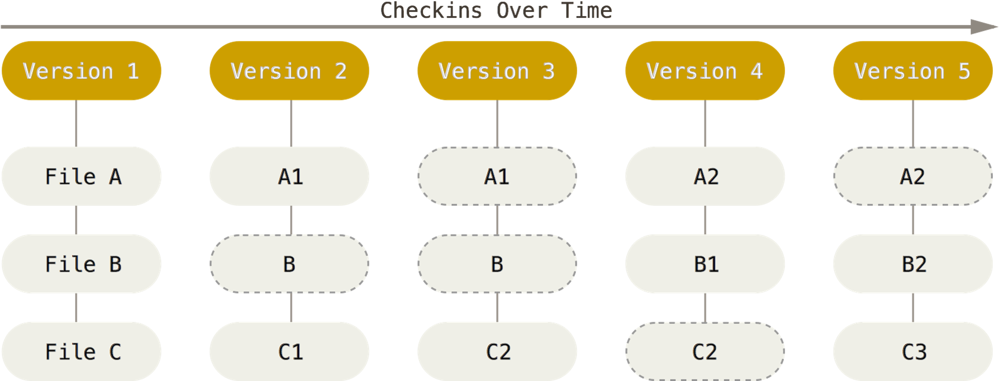

# GitHub笔记

## Git 入门
### 一、git网站了解、仓库创建、设置
### 二、git工具

	#显示当前Git配置
	git config --list

	#设置提交仓库是的用户名信息
	git config --global user.name "username"

	#设置提交仓库是的邮箱信息
	git config --global user.email "xxxx@xxx.com"

### 三、git 命令

- **概念**：
```
Workspace: 工作区   #未被版本控制
Index/Stage:　暂存区 
Repository：仓库区（或本地仓库）
Remote: 远程仓库，例如github 、开源中国
```
- **命令**：	
  - 本地仓库命令
```	
	#在当前目录新建一个git代码库
	git init
	
	#下载一个项目和它的整个代码历史
	#URL格式： https://github.com/[username]/reposName
	git clone [url]
	
	#添加指定文件到暂存区
	git add [file1] [file2]
	
	#删除工作区文件,并将这次删除放入暂存区
	git rm [file1] [file2]
	
	#改名文件，并且将这个改名放入暂存区
	git mv [file-origin] [file-renamed]
	
	#提交暂存区到仓库
	git commit -m [message]
	
	#直接从工作区提交到仓库
	#前提该文件已经有仓库中的历史版本
	git commit -a -m [message]
	
	#显示变更信息
	git status
	
	#显示当前分支的历史版本
	git log
	git log --oneline #一行显示
	
	#查看某一个版本的变更信息
	git show [hashcode]
```

  - 远程仓库命令
```
	#增加远程仓库，并命名
	git remote add [shortname] [url]

	#将本地的提交推送到远程仓库
	git push [remote] [branch]

	#将远程仓库的提交拉下到本地
	git pull [remote] [branch]

	#查看git与那个远程仓库建立了连接
	git remote -v

	#在目录下直接clone 远程仓库
	git clone [url]
```

[在线练习GitHub命令: https://try.github.io](https://try.github.io)

## Git 进阶  

### Git 简介
开源的分布式的版本管理系统。发明人 Linus Torvalds（Linux 创始人）。  
- 优势：
  - 便宜快速的本地分支
  - 所有内容都在本地端
  - Git 很快
  - Git 很省磁盘空间
  - Staging 功能
  - 它是分布的
  - 适用任何工作流程

**版本控制**
- 本地版本控制系统（无法协同工作）  
- 集中式的版本控制系统（中央服务器的单点故障）
- 分布式的版本控制系统

**Git 存储方式**
- 传统版本控制系统存储方式(保留所有差异版本) 

- Git的存储方式（1.快照<gzip压缩>和指针 2.打包文件<存储文件和差异>）
  

**三个区域**

**四种状态**
Untracked 和 Modified 是工作区的两个状态。


### GUI 工具  
- Git GUI
- Source Tree
- EGit

**Git GUI**


