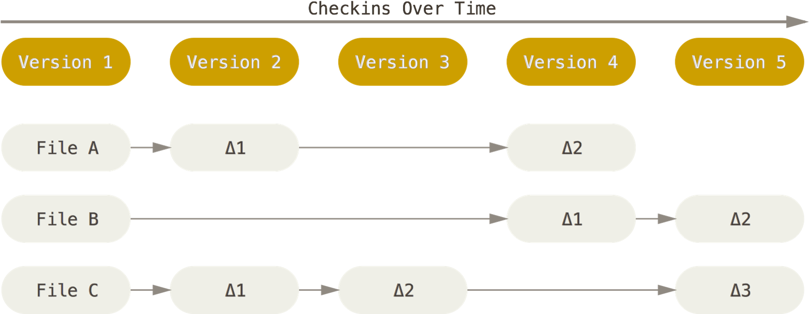
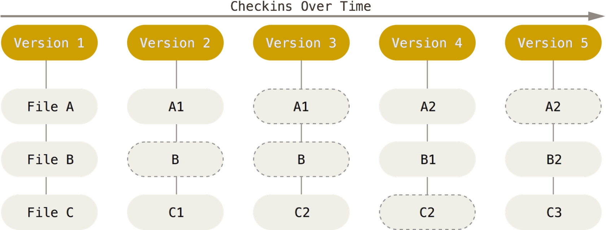
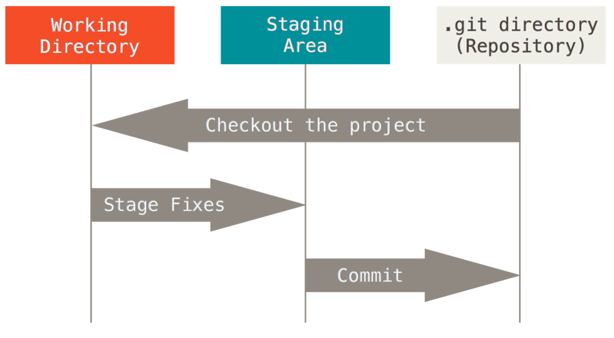
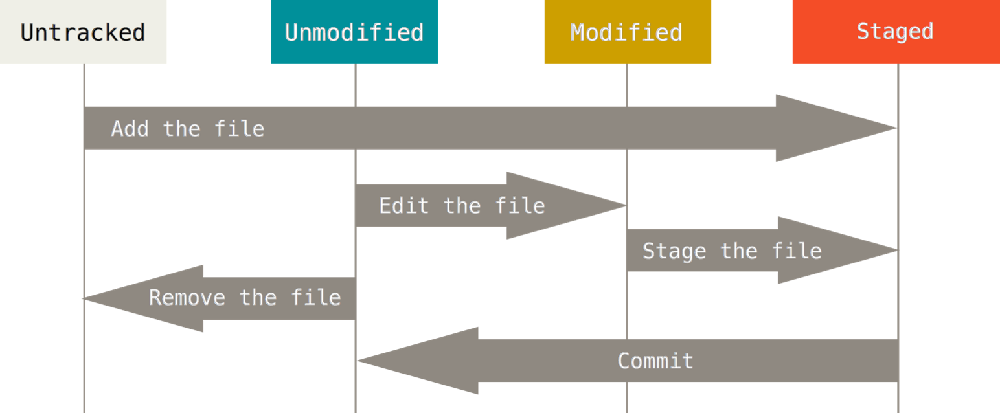
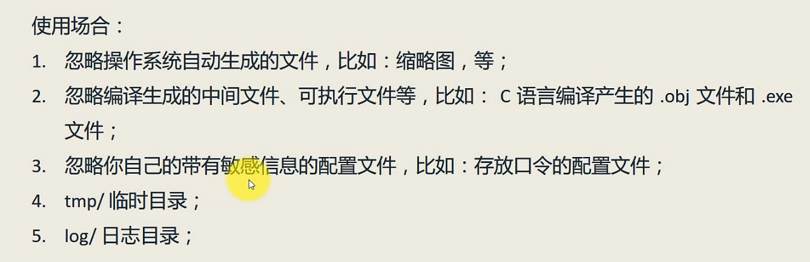
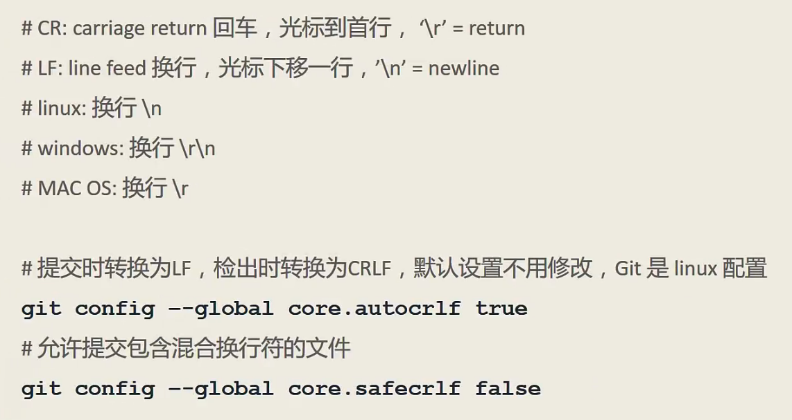
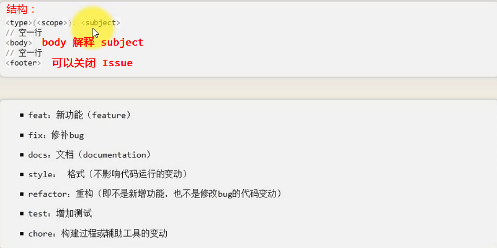

# Git 进阶  

## Git简介
开源的分布式的版本管理系统。发明人 Linus Torvalds（Linux 创始人）。  
- 优势：
  - 便宜快速的本地分支
  - 所有内容都在本地端
  - Git 很快
  - Git 很省磁盘空间
  - Staging 功能
  - 它是分布的
  - 适用任何工作流程

### 版本控制
- 本地版本控制系统（无法协同工作）  
- 集中式的版本控制系统（中央服务器的单点故障）
- 分布式的版本控制系统

### Git 存储方式
- 传统版本控制系统存储方式(保留所有差异版本) 

- Git的存储方式（1.快照<gzip压缩>和指针 2.打包文件<存储文件和差异>）
  

### 三个区域

### 四种状态
Untracked 和 Modified 是工作区的两个状态。


## GUI工具  
- Git GUI
- Source Tree
- EGit(Eclipse插件)


**Git GUI**
启动图形界面历史记录（快捷键）
Git Bash 下命令： gitk

## Git 配置
### .gitignore
`# 后接注释`

.gitignore 模板
GitHub 在新建仓时有一些模板，按语言分类。
<https://github.com/github/gitignore>
查看忽略规则 `git check-ignore -v .project`

### 换行符

~~
### 别名  
如：查看历史记录（图形形式）
```Bash
git log --pretty=format:'%h %ad | %s%d [%an]' --graph --date=short
哈希值 提交时间 | 提交信息 [提交人] --图形显示 --短日期
```
设置别名
```
git config --global alias.ci commit
将 commit 设置别名为 ci
```
```
cd ~ 到根目录下修改.gitconfig文件设置别名
cd - 回到仓库
```
### 凭证

方法1：
```
#存储凭证,使用 wincred 工具管理凭证
git config --global credential.helper wincred
```

### Git 协议
- 本地协议  
- Git 协议 
```
特点：没有权限控制，授权机制、访问速度快，一般设置为只读，配合其他协议使用，要求防火墙开9418端口。

# 克隆远程仓库
git clone git://server_ip/test.git

# 添加远程连接
git remote add origin git://server_ip/test.git
``` 
- Http 协议  
```
# 克隆远程仓库
git clone https://github.com/***/***.git

# 添加远程仓库的连接
git remote add origin https://github.com/***/***.git

运行方式： 端口：80、443，基于文本传输、效率低，需要输用户名密码。
```
- SSH 协议
```
# 克隆远程仓库
git clone ssh://git@github.com/***/***.git
简写 git clone git@github.com:***/***.git

# 添加远程仓库链接
git remote add origin git@github.com:***/***.git
```
```
秘钥对配置：
# 生成 RSA 密匙对
ssh-Keygen -t rsa -C "email@address"

# 在 Github 网站添加公钥

# 使用 SSH 协议，克隆仓库或添加远程链接 

```

### 基本操作进阶
**git**

```
# git 命令信息
git 

# 查看全部 git 子命令 
git help -a 

# 逐行查看文件的修改历史
git blame <file name>

# 从第100行开始，到110行。逐行查看文件的修改历史
git blame -L 100,10 <file name>

# 列出打算清除的档案，即未被跟踪的档案
git clean -n

# 真正删除上面列出的这些档案
git clean -f

# 连 .gitignore 中忽略的档案也清除
git clean -x -f

# 查看状态更简略的显示
git status -sb

```

**git add 深入**
```
# 添加新文件、删除文件、修改文件（增删改）、移动文件、修改文件名（git mv a b）
# 文件夹的操作（添加、删除、移动、改名）
git add .

# 一个文件多个提交
git add -p
```

**git commit 深入**
- commit 提交原则：
  - 每个提交保证适当的颗粒度、相关性和独立性
  - 一个小功能、小改进或一个 bug fix 为单位
  - 对应的 Unit Test 程序在同一个
  - 无相关的修改不在同一个 commit
  - 语法错误的半成品程序不能作提交
- 规范注解
  - Angular 规范  

```
git commit 进入文本编写
<footer> 区可以用来关闭 Issues ： 用法 close #IssuesID
```

<<<<<<< HEAD
**信息查看深入**


=======
**信息查看深入**
>>>>>>> 1cef2d1631c07e84ccf21f352bc677c8c2f87235
