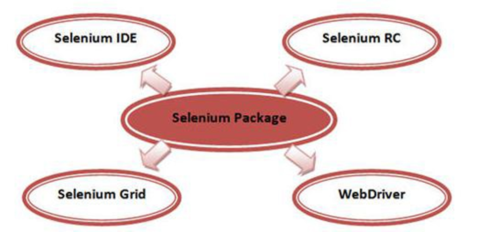

# Selenium (基于Java语言)
## 一、Selenium 介绍
&emsp;&emsp;Selenium 是 ThoughtWorks 专门为 Web 应用而开发的自动化测试工具，适合进行功能测试、验收测试，同时支持所有基于 web的 管理任务自动化。

### 工具特点
1. 开源、免费。
1. 多浏览器支持：Firefox、Chrome、IE、Opera。
1. 多平台支撑：windows、linux、MAC。
1. 对web页面有良好的支撑。
1. 简单（API简单）、灵活（用开发语言驱动）
1. 支持分布式执行测试用例

### 版本特点
&emsp;&emsp;Selenium 共经历了三个版本1.0、2.0、3.0。Selenium 3.0 是 selenium 最新发布版本，目前已经发布了2个beta版本出来。
&emsp;&emsp;Selenium 2.0 是把 Webdriver 加入到这个家族中，简单的公式为：
&emsp;&emsp;&emsp;&emsp;&emsp;&emsp;_Selenium 2.0 = Selenium 1.0 + Webdriver_ 

### 组成   
&emsp;&emsp;selenium 不是一个简单的工具，而是由几个工具组成。


- **Selenium IDE**  
Selenium IDE 是嵌入到 Firefox 浏览器中的一个插件，实现简单的浏览器录制与回放功能。
- **Selenium Gird**  
Selenium Gird 是一种自动化测试的辅助工具，Gird 通过现有的计算机基础设施，能加快 web 的功能测试，利用 Gird，可以很方便的同时在多台机器上和异构环境中并行运行多个测试用例。其主要特点：
  - 并行执行。
  - 通过一个主机统一控制用例在不同环境、不同浏览器下运行。
  - 灵活添加变动测试机器。  
- **Selenium RC**  
  - Selenium RC 是 Selenium 家族的核心工具，Selenium RC 支持多种不同的语言编写自动化测试脚本，通过 Selenium RC 的服务器为代理服务器去访问应用从而达到测试的目的。         
  - Selenium RC 使用分 Client Libraries 和 Selenium Server，Client Libraries 库主要用于编写测试脚本，用来控制 Selenium Server 的库。
  - Selenium Server 负责控制浏览器的行为，它主要包含3部分：
	Launcher、Http Proxy、Core。其中 Core 是被 Selenium Server 嵌入到浏览器页面中，它本质是 JS 函数的集合，通过对这些 JS 函数进行操作，实现用程序对浏览器进行操作。Launcher 用于启动浏览器，把 Core 加载 到浏览器页面中，并把浏览器代理设置成为Selenium Server 的 Http Proxy。
- **WebDriver**
WebDriver 通过原生浏览器支持或者浏览器扩展直接控制浏览器。 WebDriver 针对各个浏览器而开发，取代了嵌入到被测 web 应用中的 JavaScript，与浏览器紧密集成。同时 WebDriver 还利用操作系统级的调用模拟用户输入。  

### 环境搭建  
&emsp;&emsp;详见[博客](http://www.cnblogs.com/dzdwr3/p/7048039.html)。  

### Demo  
&emsp;&emsp;一个 selenium 实例：

```Java
import org.openqa.selenium.By;
import org.openqa.selenium.WebDriver;
import org.openqa.selenium.WebElement;
import org.openqa.selenium.firefox.FirefoxDriver;

public class openBaidu {

	public static void main(String[] args) throws Exception {

		WebDriver driver = new FirefoxDriver();
		driver.get("https://www.baidu.com");
		driver.manage().window().maximize();
		driver.findElement(By.id("kw")).sendKeys("12306");
		WebElement btn = driver.findElement(By.id("su"));
		btn.click();
		Thread.sleep(3000);
		driver.close();
	}
}
```
&emsp;&emsp;该段代码实现的功能是 使用火狐打开百度首页，输入12306进行搜索，然后退出。

## 二、Selenium 使用  
### [浏览器驱动](./brower_driver.md)
- FireFox  
- Chrome  
- InternetExplorer  
### [浏览器API](./browser_api.md)
### [对象定位](./object_location.md)
- 定位一个对象  
- 定位一组对象  
- 层级定位  
- Frame 内对象定位  
### [对象操作](./object_operation.md)
- 常用方法  
- 鼠标事件  
- 键盘事件  
- 等待时间  
- alert \ confirm \ prompt  
- select 菜单处理
### [其他操作](./extend.md)
- 多窗口  
- 调用JS  
- 验证码处理  


