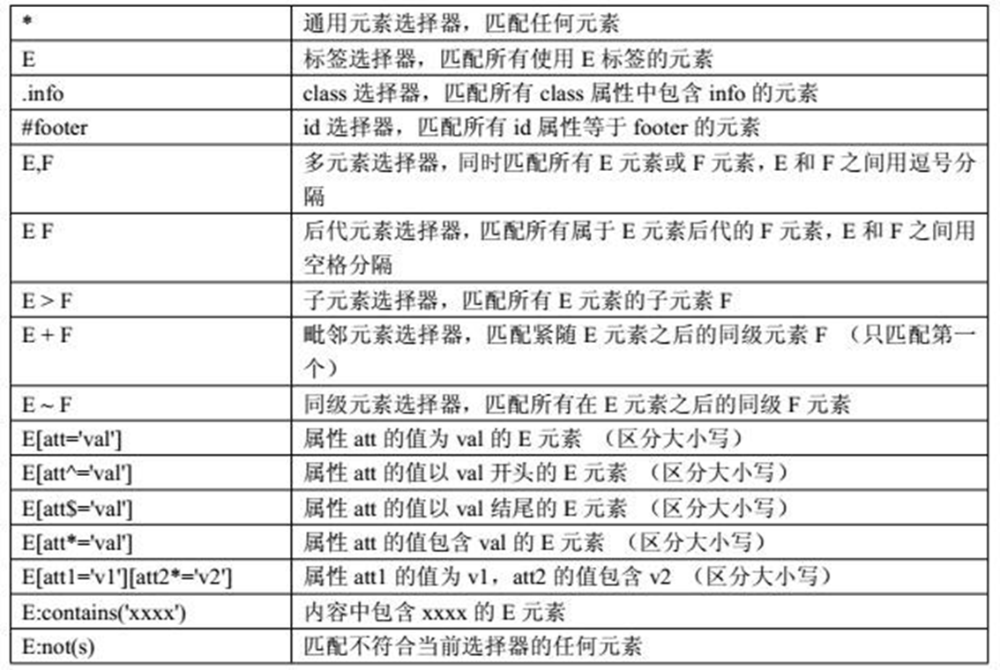
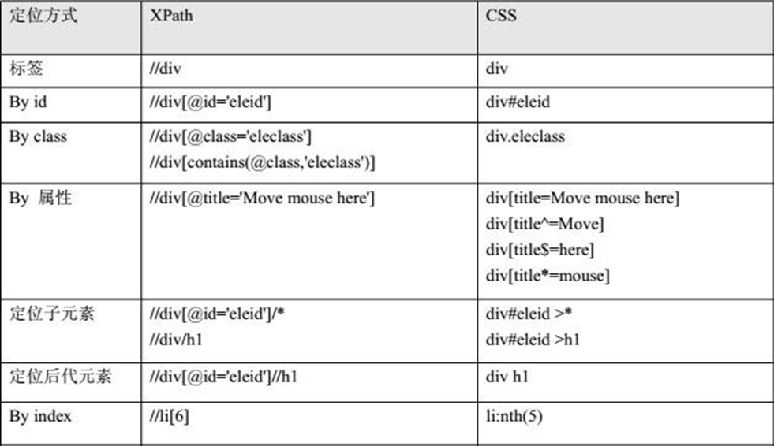

# Selenium 对象定位
&emsp;&emsp;对象的定位和操作是自动化测试的核心部分，其中操作又是建立在定位的基础上的。
&emsp;&emsp;举例：一个对象就是一个人，我们可以通过身份证号、姓 名或者他的住址找到这个人。那么一个 web 界面对象也是一样的，我们可以通过唯一区别于其它对象的属性来定位这个元素。

## 工具介绍
- Firebug  
Firebug 是网页浏览器 Mozilla Firefox下的一款开发类插件，它集 HTML 查看和编辑、Javascript控制台、网络状况监视器于一体，是开发 JavaScript、CSS、HTML 和 Ajax 的得力助手。
安装 Firebug：
Mozilla Firefox 菜单--附加组件--插件--搜索 Firebug --安装--重启浏览器。
- chrome 和 IE 的开发者工具
chrome 浏览器自带开发者工具，浏览器右上的小扳手，在下拉菜单中 选择“工具”--“开发者工具”  即可打开，也可以使用快捷键 Ctrl+Shift+I 或者 F12。

## 定位单个对象
**7种常见定位方式**
- 通过id定位对象 findElement(By.id("id_vaule")) 
- 通过name定位对象： findElement(By.name("name_vaule")) 
- 通过class_name定位对象： findElement(By.className("class_name"))
- 通过tag_name定位对象： findElement(By.tagName("tag_name")) 
- 通过link定位对象： findElement(By.linkText("text_vaule")) 或 findElement(By.partialLinkText("text_vaule")) 
- 通过cssSelector定位对象： findElement(By.cssSelector()) 
- 通过xpath定位对象：findElement(By.xpath())

示例1：
```
用户名文本框
<input type="text" placeholder="用户名" name="username" id="J_username" class="input" required="">

1.通过id定位对象： findElement(By.id("J_username"))

2.通过name定位对象： findElement(By.name("username"))

3.通过class_name(样式名)定位对象： findElement(By.className("input"))

4.通过tag_name(标签名)定位对象： findElement(By.tagName("input"))
  备注：tag_name应该是所有定位方式中最不靠谱的一种，因为在一个页面上 相同tag_name的元素极其容易出现。

```
示例2：
```
百度新闻链接
<a href="http://news.baidu.com" name="tj_trnews" class="mnav">新闻</a>

5.通过link定位对象： findElement(By.linkText("新闻")) findElement(By.partialLinkText("新"))
备注：当一个文字很长的链接时，我们可以只取其中的部分，只要取的部分可以唯一标识元素

6.通过xpath定位对象： findElement(By.xpath(".//*[@id='u1']/a[2]"))

7.通过cssSelector定位对象：findElement(By.cssSelector("a[name=\"tj_trnews\"]"))

```

>**请注意：以上所有的定位均可以通过最后两种定位方式来完成，下面具体介绍 xpath 和 cssSelector 两种通用的定位方式**。

### 通过xpath定位对象
&emsp;&emsp;xpath 是一种在 XML 文档中定位元素的语言。因为 HTML 可以看作是 XML 的一种形式，selenium 可使用这种强大语言在 web 应用中定位对象。
&emsp;&emsp;xpath 有6种定位对象的方式：
```
1、通过绝对路径做定位 XPath 的开头是一个斜线（/）代表这是绝对路径。
div: /html/body/div[3]/div[1]/div/div[3] 
a: /html/body/div[3]/div[1]/div/div[3]/a[2] 

2、通过相对路径做定位 如果开头是两个斜线（//）表示文件中所有符合模式的对象都会被选出来， 即使是处于树中不同的层级也会被选出来。
findElement(By.xpath("//div[3]/a")) 返回查找到的第一个符合条件的对象

3、通过对象索引定位，索引的初始值为1 
findElement(By.xpath("//div[3]/a[2]") 定位文件中第2个a对象

4、使用属性定位
举例：<a class="mnav" name="tj_trnews" href="http://news.baidu.com">新 闻</a>
findElement(By.xpath("//a[@name='tj_trnews']")) findElement(By.xpath("//a[@name='tj_trnews' and @class='mnav']")) findElement(By.xpath("//a[@name='tj_trnews' or @class='mnav']"))

5、使用部分属性值匹配 
starts-with()
findElement(By.xpath("//a[starts-with(@name,'tj_trnews')]"))

ends-with() (XPath1.0 中没有 ends-with 函数,2.0 有,现在浏览器实现的都是 1.0)
可以用如下代替：
findElement(By.xpath("//a[substring(@name,String.length(@name)- 5)='trnews']"))

contains() 
findElement(By.xpath("//a[contains(@name,'trnews')]"))

6、使用任意属性值匹配对象 
findElement(By.xpath("//*[@*='tj_trnews']"))

7、使用xpath的text函数 
findElement(By.xpath("//a[text()='新闻']"))  绝对匹配
findElement(By.xpath("//a[contians(text(),'新闻')]")) 包含（模糊）匹配

举例：
//*[@class='foo' or contains(@class,'foo') or starts-with(@class,'foo') or substring(@class,string-length(@class)-3)='foo']

```

### 通过cssSelector定位对象  
```
1、使用绝对路径来定位元素。
CSS绝对路径指的是在DOM结构中具体的位置，使用绝对路径来定位用户名输入字段，在使用绝对路径的时候，每个元素之间要有一个空格。
如：findElement(By.cssSelector("html body div div div div form span input")) 
这种策略有一定的局限性，如果界面的布局改变了，那么可能就定位不到我 们想要的元素了。


2、使用相对路径来定位元素 当使用CSS选择器来查找元素的时候，我们可以使用class属性来定位元素。
我们可以先指定一个HTML的标签，然后加上一个”.”符合，跟上class属性的值。
findElement(By.cssSelector("div a.mnav"))

3、使用相对ID选择器来定位元素 可以使用元素的ID来定位元素，先指定一个HTML标签，然后加上一个”#” 符号，跟上id的属性值。
findElement(By.cssSelector("input#kw")) 
findElement(By.cssSelector("#kw")) 

4 、使用属性值选择器来定位元素 通过指定元素中属性值来定位元素 
单属性：findElement(By.cssSelector("a[name='tj_trnews']")) 
多属性： findElement(By.cssSelector("a[name='tj_trnews'][class='mnav']")) 
多属性主要用于在一个属性不足以定位一个元素的时候。

5、部分属性值的匹配 CSS选择器提供了一个部分属性值匹配定位元素的方法，这为了测试那些页面上具有动态变化的属性的元素是非常有用的，例如界面对象的 id,className是动态变化的。
匹配前缀：^=	
匹配后缀：$= 
匹配字符串：*=
举例：
匹配以 tj_  开始的链接 
findElement(By.cssSelector("a[name^='tj_'][class='mnav']"))

匹配以 news 结尾的链接 
findElement(By.cssSelector("a[name$='news'][class='mnav']")) 

匹配包含 news  字符串的链接
findElement(By.cssSelector("a[name*='news'][class='mnav']")) 

6、列表选择具体的匹配 Selenium中的CSS选择器允许我们更细致的浏览列表下的元素，如我想选择第三行链接，可以用 nth-of-type 或者 nth-child  
findElement(By.cssSelector("div a[class='mnav']:nth-of-type(3)")) 
findElement(By.cssSelector("div a[class='mnav']:nth-child(3)"))
```
### 总结 
&emsp;&emsp;CSS 定位语法比 Xpath 简洁，定位方式更灵活多样；不过对 CSS 理解比 Xpath 难；但不管是从性能上还是定位更复杂的元素上，CSS 优于 Xpath。


**附：**
>常用常用CSS定位语法



>xpath和css部分定位功能对比



## 定位一组对象  
&emsp;&emsp;webdriver 使用 findElement 方法定位一个特定的对象，不过我们有时需定位一组对象，webdriver 同样提供了定位一组元素的方法叫 findElements().
&emsp;&emsp;定位一组对象一般用于以下场景：
- 批量操作对象，比如将页面上的checkbox都勾选上。
- 先获取一组对象，再在这组对象中过滤需要具体定位的一些对象。

例：使用tag_name 定位一组指定页面上的checkbox 
```Java
List<WebElement> inputs = driver.findElements(By.tagName("input"));
for (WebElement input : inputs) {
	if (input.getAttribute("type") == "checkbox")
		input.click();
}
```
## 层级定位


